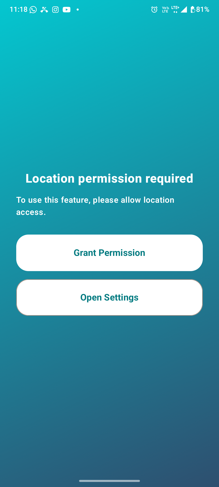
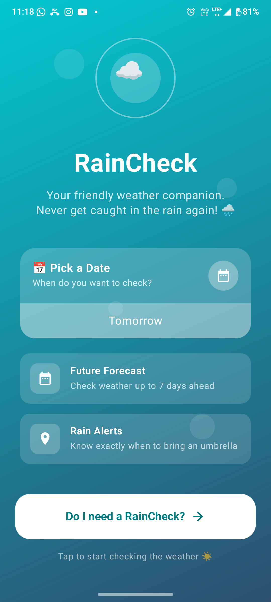
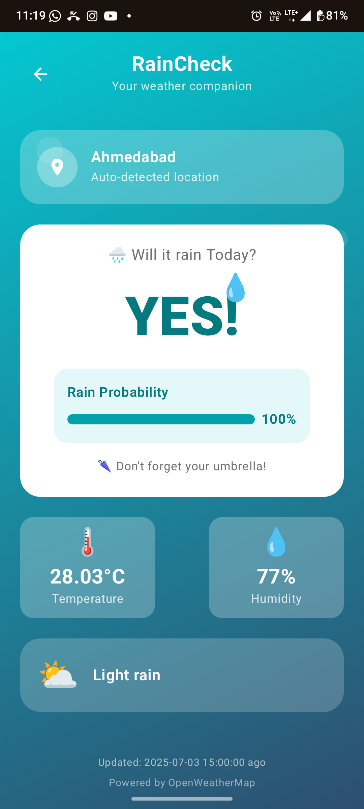

# Rain Checker

## 📌 Overview

This project is an **Rain Checker** built using **Jetpack Compose** and the **MVVM
architecture**. It includes essential libraries such as **Hilt for Dependency Injection, Retrofit
for API calls etc**.

---

For Demo download [APK](Apk/RainChecker_V1.0_28_06_2025-production-debug.apk)


## 📦 Dependencies & Versions

Below are the key dependencies and their respective versions used in this project:

| Library                       | Version       |
|-------------------------------|---------------|
| AGP (Android Gradle Plugin)   | 8.8.0         |
| Kotlin                        | 2.0.21        |
| Compose BOM                   | 2025.01.01    |
| Hilt Navigation Compose       | 1.2.0         |
| Core KTX                      | 1.15.0        |
| Activity Compose              | 1.10.0        |
| Lifecycle Runtime KTX         | 2.8.7         |
| Navigation Compose            | 2.8.6         |
| Retrofit (Networking)         | 2.11.0        |
| Gson Converter (JSON Parsing) | 2.11.0        |
| Timber (Logging)              | 5.0.1         |
| OkHttp Logging Interceptor    | 4.12.0        |

---

## 📜 Project Modules

This project uses the following **core libraries**:

- **Jetpack Compose**: Modern UI Toolkit
- **Hilt**: Dependency Injection
- **Retrofit**: API Handling
- **Timber**: Logging Utility

---

## 🚀 Features Implemented

- MVVM Architecture
- API Calls using Retrofit + Gson Converter
- Navigation using Jetpack Navigation Compose
- Dependency Injection using Hilt
---


## Demo








## 📌 Setup & Installation

1. **Clone the repository:**
   ```sh

   git clone https://github.com/AdnanMahida/RainChecker.git 
   cd RainChecker

   ```
2. **Open the project in Android Studio**
  ```sh
   change OPEN_WEATHER_API_KEY in the build.gradle.kts (app level) api key generated from the https://openweathermap.org.
   
   ```
3. **Sync Gradle:** Click `Sync Now` when prompted.
4. **Run the app on an emulator or physical device.**

---

## 🛠️ Build & Run

This project is configured with **Gradle Version Catalog**, making dependency management easier. To
build and run:

```sh
./gradlew assembleDebug
```

For a **release build:**

```sh
./gradlew assembleRelease
```

---

## 👨‍💻 Code Structure

- `ui/` → Jetpack Compose UI Components
- `viewmodel/` → ViewModels following MVVM
- `repository/` → Repository Layer
- `network/` → Retrofit API Services


## 👨‍💻 References
- Youtube
- Developer official side
- Stackoverflow
- Github
- AI Tools

Done <3 Happy Coding
